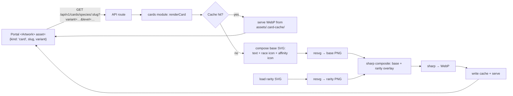

# Plan V2: WaifuMon SVG Card Rendering System

> **Revision history.** V1 recommended treating `archetype` as race, merging rarity SVGs into the base DOM, mapping `EX → UR`, using mtime+size as an artwork fingerprint, and rasterizing all 245 (rarity × race × affinity) combinations in CI. V2 supersedes those choices per the decisions on 2026-08-14: `race` becomes a first-class field with archetype fallback, `EX` is a first-class rarity with its own SVG, rarity is composited as a raster overlay (not merged structurally), the artwork fingerprint is a real content hash, and the render matrix is replaced by ~7 representative renders plus unit-level coverage of each dimension.

## TL;DR
Add a **server-side, data-driven card renderer** that composes the existing SVG kit + character artwork into a WebP, exposed through the Platform API as a new `AssetId` kind (`kind: 'card'`). Rendering lives in a new `src/modules/cards/` service, uses `@resvg/resvg-js` + `sharp`, writes to a content-addressed disk cache under `assets/.card-cache/`, and is invalidated automatically by cache key. The Portal consumes it via a new `card` provider in the existing image resolver chain — its `<Artwork>` component doesn't change.

Species content gains **two additive fields**: a top-level optional `race?: RaceCode` (with archetype-derived fallback so no content edits are required to ship) and an optional `card` block for the presentation-only fields the SVG kit expects (subtitle, artist, ability, flavor quote, card number). Both are JSON-only for v1 — no DB migration. The renderer supports **all seven rarities including `EX` as a first-class asset** (no substitution). Composition is **layered raster**: the base template is composed structurally with dynamic content and rasterized once; rarity is rasterized independently and composited on top with sharp. This keeps rarity overlays fully replaceable without touching renderer code.

A `CARD_RENDERER_ENABLED` env flag gates rollout during Phase 3–5; Phase 6 removes it (default-on) once the renderer is stable in production.

## Recommendation on Browser vs Server Rendering
**Server-side (Option A)**, with strong reasons rooted in this repo:

- `portal/src/__tests__/architecture.test.ts` enforces that the API never leaks image paths. The Portal already resolves art through `AssetId` + a provider chain. A new `kind: 'card'` fits that contract exactly; a browser SVG composer would require introducing raw artwork paths, string-substitution, and font/loader complexity into the SPA.
- The Portal is pure Tailwind + `` today — no SVG imports, no `dangerouslySetInnerHTML`. Introducing an SVG composer breaks a clean model.
- The bot doesn't render images yet, but "Discord-renderable card images" is a listed future requirement. A server renderer serves both without duplicating logic.
- Rasterization is deterministic and produces one artifact per (character × variant × template version) that can be cached, CDN-shipped, and downloaded at full resolution.
- Portal keeps instant, cheap thumbnails via the existing `/dev-assets/t/<width>/` path (rendered card is just another asset in that pipeline).

Option C (hybrid) was considered but rejected: adding two render paths doubles the "what does a card actually look like?" surface area and diverges over time. Server rendering can still be swapped for Satori/browser rendering later behind the same `kind: 'card'` contract without a data model change.

---

## Current State (verified findings)

Where each concern already lives:

- **Species / card metadata** — DB: [src/db/schema.ts](../src/db/schema.ts) (`species` table); Zod: [src/modules/content/schemas.ts](../src/modules/content/schemas.ts) (`SpeciesContentSchema`); JSON: [content/species/starter.json](../content/species/starter.json), [content/species/placeholders.json](../content/species/placeholders.json). Existing fields: `slug, name, rarity, archetype, baseCaptureRate, description, tags, contentRating, affinity, imagePath, enabled, eventKey, perSpeciesWeight`.
- **Rarity** — `RARITIES = ['N','R','SR','SSR','UR','LR','EX']` in [src/db/schema.ts](../src/db/schema.ts). Kit currently ships six overlays; **`ex.svg` must be added** so `EX` is a first-class rarity — the renderer never substitutes another rarity for `EX`.
- **Affinity** — `AFFINITIES = ['dominant','submissive','caregiver','primal','switch']` in [src/db/schema.ts](../src/db/schema.ts). Matches SVG kit exactly.
- **Race** — Does **not** exist as a dedicated field today. `archetype` is free-form but the corpus already uses exactly the 7 target race codes `angel, demon, demi-human, human, spirit, valkyrie, android` (verified across every content JSON entry). V2 adds a dedicated `species.race?: RaceCode` field; `archetype` remains a semantically distinct field (narrative role) and only serves as a fallback when `race` is absent.
- **Level / progression** — `player_waifus.level` + `player_waifus.variant` (appearance id). Multiple variants per species; unlocks derived by [src/modules/appearance/appearanceRules.ts](../src/modules/appearance/appearanceRules.ts).
- **Artwork paths** — internal `species.imagePath` (never leaked) and appearance PNGs at `assets/waifumon/<slug>/<appearance-id>.png`. Sync via [src/tools/appearanceSync.ts](../src/tools/appearanceSync.ts).
- **Existing portal card UI** — pure Tailwind `` components: [portal/src/components/waifumon/WaifumonCard.tsx](../portal/src/components/waifumon/WaifumonCard.tsx), [portal/src/features/encyclopedia/SpeciesCard.tsx](../portal/src/features/encyclopedia/SpeciesCard.tsx), [portal/src/features/collection/WaifumonDetail.tsx](../portal/src/features/collection/WaifumonDetail.tsx). Asset resolution: [portal/src/images/](../portal/src/images/) provider chain via `AssetId`.
- **Static asset serving** — no `@fastify/static` on the API. Portal Vite dev server proxies `/dev-assets/*` → `../assets/` (see [portal/vite.config.ts](../portal/vite.config.ts)). Production has no CDN yet.
- **Image dependencies** — root: none. Portal (dev-only): `sharp@^0.35.3`. No `resvg`, `satori`, `puppeteer`, `canvas`.
- **Discord bot** — no image attachment or rendering code today ([src/discord/](../src/discord/) is text-embed only).
- **Testing** — Vitest with per-DB testcontainers; no snapshot files; portal tests use MSW.
- **SVG kit** — 1000×1400 viewBox, `character-art` uses `href="character-art.png"` (relative — renderer must rewrite). Each rarity SVG **bakes its own `rarity-badge`** with the letter code embedded, so the renderer does not draw rarity text — it composites the whole rarity file as an overlay. Rarity gradients use IDs like `rarityStroke` and `glow` that would collide if two rarity SVGs (or base + rarity) were ever merged into one XML document; V2's layered raster composition avoids that class of problem entirely.

### Missing species fields (needed by SVG kit)
Not present in `SpeciesContentSchema`, added as **optional** in Phase 2:

- Top-level: `race?: RaceCode`
- Nested `card?` block: `subtitle`, `artist`, `ability.{name,text}`, `flavorQuote`, `cardNumber`

All optional; unmodified content keeps rendering with sensible defaults (subtitle blank, ability hidden, artist "Unknown", race derived from `archetype`).

---

## Proposed Architecture

### Data flow



The renderer is called only by the API route. Nothing else imports it directly, so it can be swapped (Satori, headless browser) without touching content, portal, or bot.

### Module boundary
- `src/modules/cards/` — renderer service (pure, no Fastify types)
- `src/modules/cards/assets/` — SVG loader with in-process memoization and version hash
- `src/modules/cards/composer/` — base-SVG DOM assembly (structural, not string replacement); rarity SVGs are NOT merged here — they are rasterized separately
- `src/modules/cards/rasterizer/` — resvg pipeline for base + rarity, sharp for composition and WebP encode
- `src/modules/cards/cache/` — content-addressed disk cache
- `src/api/routes/v1/cards.ts` — thin Fastify layer that resolves species/waifu, calls the module, streams the response
- `portal/src/images/providers/cardApi.ts` — new provider that answers `kind: 'card'`

---

## Data Model Changes

All additions are **JSON-only, optional, additive**. No DB migration for v1. The database's existing `species` table stays as it is; if DB-backed editing of card metadata is ever wanted, a single `card_meta jsonb` column would be added — explicitly out of scope for v1.

### Top-level `race` (new, optional)
Add a species-level field alongside `archetype`, not inside `card`:

```ts
type RaceCode =
  | 'angel'
  | 'demon'
  | 'demi-human'
  | 'human'
  | 'spirit'
  | 'valkyrie'
  | 'android';

interface SpeciesContent {
  // …existing fields…
  archetype: string;      // narrative role — unchanged, free-form
  race?: RaceCode;        // NEW — authoritative visual race classification
  card?: SpeciesCardMeta; // NEW — presentation-only
}
```

Race and archetype are **semantically distinct**: `archetype` describes narrative role ("librarian", "barista", "paladin" — currently coincides with race values but doesn't have to), `race` describes the biological/lore category the card frame communicates. Long-term source of truth is `species.race`; `archetype` fallback exists only for backward compatibility.

### `card` block (new, optional, presentation-only)

```ts
interface SpeciesCardMeta {
  subtitle?: string;    // 0–48 chars
  artist?: string;      // 0–48 chars
  ability?: {
    name: string;       // 1–32 chars
    text: string;       // 1–160 chars
  };                    // both fields required together or block omitted
  flavorQuote?: string; // 0–120 chars
  cardNumber?: string;  // free-form; e.g. "012/100"
}
```

`race` is deliberately **not** inside `card` — it drives visual classification and gameplay-adjacent surfacing (encyclopedia filters), not presentation typography.

### Race resolution
Add `src/modules/cards/race.ts` exporting:

- `RACE_CODES = ['angel','demon','demi-human','human','spirit','valkyrie','android'] as const`
- `archetypeToRace(archetype: string): RaceCode | null` — normalizes (lowercase, hyphenate); returns `null` for unknown so the caller can decide fallback vs error
- `resolveRace(species: Pick<SpeciesContent, 'race' | 'archetype'>): RaceCode` — uses `species.race` if set, otherwise `archetypeToRace(species.archetype)`, otherwise `'human'` with a WARN log tagged `card-renderer/race-fallback`

Content-validation loader logs (but does not reject) unknown archetypes so authors get a visible signal to migrate to explicit `race`.

### `EX` rarity is first-class
The renderer resolves rarity to an overlay SVG through a single table:

```
N    → rarities/normal.svg
R    → rarities/rare.svg
SR   → rarities/sr.svg
SSR  → rarities/ssr.svg
UR   → rarities/ur.svg
LR   → rarities/lr.svg
EX   → rarities/ex.svg
```

Asset validation runs at renderer boot: any missing rarity file is a **hard error** — no silent substitution. Phase 1 ships an `ex.svg` placeholder that is visibly distinct from `ur.svg` (different accent color and badge letter); Phase 5 upgrades the artwork.

---

## Asset Structure

Keep the kit at its current location and grow it:

```
assets/cardart/
  templates/
    card-base.svg

  rarities/
    normal.svg
    rare.svg
    sr.svg
    ssr.svg
    ur.svg
    lr.svg
    ex.svg          # NEW — first-class rarity, placeholder in Phase 1, polished in Phase 5

  icons/
    races/{angel,demon,demi-human,human,spirit,valkyrie,android}.svg
    affinities/{dominant,submissive,switch,caregiver,primal}.svg

  fonts/            # NEW — embedded fonts for deterministic rendering
    Inter-Regular.ttf
    Inter-Bold.ttf
    NotoSerif-Italic.ttf

  VERSION           # NEW — bumped whenever any asset changes; part of cache key
```

All rarity overlays are independently replaceable without renderer changes — they are loaded by filename only. Same for race and affinity icons.

`assets/.card-cache/` — gitignored, generated. Path shape:

```
assets/.card-cache/<slug>/<hash>.webp
```

V1 stores **WebP masters only**. Smaller display sizes are derived on demand from the master (see Caching). PNG export can be added later if a concrete need appears — the module boundary supports it without a data model change.

Naming rules: lowercase, hyphenated for race and affinity, snake_case for slugs (already the convention).

---

## Renderer API

```ts
// src/modules/cards/types.ts
export interface CardRenderInput {
  species: {
    slug: string;
    name: string;
    rarity: Rarity;             // 'N' | 'R' | 'SR' | 'SSR' | 'UR' | 'LR' | 'EX'
    race: RaceCode;             // resolved by caller via resolveRace()
    affinity: Affinity;
    card?: SpeciesCardMeta;     // subtitle, artist, ability, flavor, cardNumber
  };
  variant: {
    appearanceId: string;             // e.g. 'standard', 'level_20'
    artworkAbsolutePath: string;      // resolved by caller; renderer never touches DB
    artworkContentHash: string;       // sha256 of the artwork bytes, hex; supplied by caller
  };
  progress?: {
    level: number;                    // shown on the card; defaults to 1 if omitted
    ownedCopyId?: number;             // reserved for owner-specific cards; unused in v1
  };
  output?: {
    format?: 'webp';                  // v1: WebP only; PNG deferred
    width?: number;                   // CSS-px width; default 1000 (source master)
    quality?: number;                 // webp quality; default 88
  };
  overrides?: Partial<SpeciesCardMeta>;  // per-render overrides (rare)
}

export interface CardRenderResult {
  bytes: Buffer;
  contentType: 'image/webp';
  cacheKey: string;               // hex hash; also the filename stem
  fromCache: boolean;
  width: number;
  height: number;
  etag: string;                   // strong ETag = cacheKey
}

export function renderCard(input: CardRenderInput): Promise<CardRenderResult>;
export function computeCardCacheKey(input: CardRenderInput): string;
export function warmCardCache(species: SpeciesContent, options?: WarmOptions): Promise<void>;

// Companion helpers exported by the module (defined in race.ts / rarity.ts):
export function resolveRace(species: Pick<SpeciesContent, 'race' | 'archetype'>): RaceCode;
export function rarityOverlayPath(rarity: Rarity): string;  // throws on missing asset at boot
```

Design choices:

- Pure input → output. No Fastify request, no DB handle. Callers (API, batch warmer, bot) marshal their own inputs.
- `artworkAbsolutePath` **and** `artworkContentHash` are both resolved by the caller. The renderer just reads bytes for rasterizing; the hash flows into the cache key. Callers cache the hash per artwork file (mtime→hash memoization is fine).
- `warmCardCache` iterates variants and pre-renders in the background (used by `content:prepare` and future admin "Save + Reload").
- `race` on `CardRenderInput` is already the resolved `RaceCode`; the renderer does not look at `archetype`. Race resolution is a caller responsibility so the renderer stays a pure presentation layer.

---

## Composition Strategy (layered raster)

V2 abandons "merge every SVG into one DOM." Rarity and base are **rasterized independently** and composited as PNGs by sharp. Rationale: rarity SVGs contain gradient IDs like `rarityStroke` and `glow` that would collide with each other and with base IDs if merged; keeping them separate means any future rarity SVG can use whatever internal IDs and filters it wants, forever.

Structural mutation only happens **inside the base template**, where we control the schema.

### Layer 1 — base template composition (structural)
Parse `templates/card-base.svg` with `fast-xml-parser`, then:

1. **Substitute text by `id`.** Locate `character-name`, `character-subtitle`, `level`, `race-label`, `affinity-label`, `affinity-description`, `affinity-description-2`, `ability-name`, `ability-text`, `ability-text-2`, `flavor-quote`, `artist-credit`, `card-number` and replace text content with XML-escaped user data. Elements whose content is empty/omitted are removed entirely (not left blank).
2. **Inject race and affinity icons** into the placeholder groups `<g id="race-icon">` and `<g id="affinity-icon">` by parsing the icon SVG's children and appending them inside the group. Icons use `currentColor` — we set `color` on the group.
3. **Wire artwork.** The base has `<image id="character-art" href="character-art.png" …>`. Prefer a resvg `imageLoader` callback that resolves `character-art.png` from the input's `artworkAbsolutePath`; falls back to rewriting the `href` to a `file://` absolute path if resvg's loader API changes. `preserveAspectRatio="xMidYMid slice"` already crops correctly.
4. **Serialize + rasterize.** Feed the mutated XML to resvg with embedded fonts; output is a 1000×1400 PNG buffer (base PNG).

No rarity, no rarity IDs, no cross-file gradient handling in this layer.

### Layer 2 — rarity overlay (independent raster)
Load the rarity SVG file for `species.rarity`, feed it directly to resvg (no mutation, no id namespacing), output a 1000×1400 PNG buffer with transparent background (rarity PNG).

This file can grow to include filters, patterns, animations-as-frames — the renderer treats it as an opaque asset.

### Layer 3 — sharp composite

```
sharp(basePng)
  .composite([{ input: rarityPng, blend: 'over' }])
  .webp({ quality: 88 })
  .toBuffer()
```

If the caller requests a smaller `output.width`, resize the composited result before encoding.

### Composite order (bottom → top)
1. Character artwork (inside base via resvg image loader)
2. Base template chrome, race icon, affinity icon, dynamic text (rasterized as the base PNG)
3. Rarity overlay (rasterized as a separate PNG, composited by sharp)

This matches the pipeline diagram in the brief and preserves rarity independence.

---

## Text Handling

Every user-supplied string is:

1. **XML-escaped** (`&`, `<`, `>`, `"`, `'`). Central helper; no ad-hoc string concat.
2. **Length-truncated** at hard caps enforced in Zod (see schema section) with a suffix `…`. Truncation happens in the composer, not the Zod layer, so authored strings pass validation up to their cap and the composer never has to worry about pathological input.
3. **Auto-sized** for `character-name` only: fit widths at 54/44/36 px (three tiers) by measuring approximate glyph width from a small metric table (or opentype.js if we accept the dep — probably not needed at this scale). Everything else uses fixed size; overflow truncates.
4. **Wrapped** for `ability-text` and `affinity-description`, which already have `-2` sibling elements in the template. Splitter: greedy word-wrap into 2 lines with per-line char budget (measured against font size). If content exceeds 2 lines → truncate the second line with `…`.
5. **Fonts embedded** via resvg's `font.fontFiles` option, pointing at `assets/cardart/fonts/`. Fallback family in the SVG stays `Arial, Helvetica, sans-serif` for browser preview but rendering is deterministic on server thanks to embedded fonts. Explicitly configure `defaultFontFamily: 'Inter'` on resvg; no system font resolution.

Edge cases handled in unit tests: empty strings (element removed rather than left with placeholder), CJK characters, emoji (fall back to Noto or strip in v1 — decision below), RTL scripts (not a v1 concern; log warning).

---

## Rendering & Caching

### Libraries
Add to root `package.json`:
- `@resvg/resvg-js@^2.6` — SVG → PNG (Rust, prebuilt binaries, works in Alpine Docker)
- `sharp@^0.33` — PNG → WebP + composite (already trusted by the portal build)
- `fast-xml-parser@^4` — structural mutation of the base SVG only
- `@types/…` where relevant

### Output dimensions
Master is 1000×1400 WebP (matches the source SVG viewBox). Smaller display sizes are **derived on demand from the master** via sharp resize — aligned with the existing `IMAGE_SIZE_BUCKETS = [256, 512, 1024]` from [portal/src/images/types.ts](../portal/src/images/types.ts). Derived sizes are cached under the same cache key with a size suffix (`<hash>@512.webp`). If a bucket cache miss occurs but the master exists, resize from the master — do not re-run resvg.

### Cache key (content-addressed)
`sha256(canonicalJson({…})).slice(0,16)` over every input that can affect rendered pixels. Canonicalization sorts object keys, normalizes empty strings, and strips absolute paths. Fields:

- `species.slug`, `species.rarity`, `species.race` (resolved), `species.affinity`
- `species.card` block (subtitle, artist, ability{name,text}, flavorQuote, cardNumber)
- `species.name` (goes on the card)
- `progress.level` (goes on the card)
- `variant.appearanceId`
- `variant.artworkContentHash` — **sha256 of the artwork bytes** (not mtime, not size). Callers memoize per artwork file to avoid re-hashing.
- `output.width`, `output.format`, `output.quality`
- `kitVersion` = contents of `assets/cardart/VERSION`
- `rendererVersion` = constant string in `src/modules/cards/version.ts`, bumped on renderer code changes

Identical inputs produce the same key regardless of filesystem timestamps or absolute paths. Master filename: `<slug>/<key>.webp`. Bucket filename: `<slug>/<key>@<width>.webp`.

### Writes
Serving code checks disk; on miss it renders and writes atomically (`.tmp` in the same directory + `rename`). Concurrent identical requests deduplicate via an in-process promise map keyed on cache key so we render each combo once.

### Invalidation
- **Automatic**: any change to artwork bytes, card metadata, race/affinity/rarity, level, template, kit VERSION, or renderer version changes the key. Old files become orphans.
- **Deliberate**: bump `assets/cardart/VERSION` to invalidate the entire cache after a visual asset refresh. No manual purge required.
- **GC**: `npm run cards:gc` iterates the cache and deletes files whose key doesn't match any current species×variant. Optional; run periodically if disk becomes a concern.

### HTTP semantics
- Response: `ETag: "<cacheKey>"`, `Cache-Control: public, max-age=300, must-revalidate` (mirrors existing `/dev-assets`), `Content-Type: image/webp`.
- `304 Not Modified` on matching `If-None-Match`.
- Immutable option: if a client requests `?v=<cacheKey>`, respond `max-age=31536000, immutable`. Portal's `useImage` can append this once the API tells it the key.

---

## Playtest Integration

Minimal, non-invasive:

1. **New Platform API routes** in [src/api/routes/v1/cards.ts](../src/api/routes/v1/cards.ts) (new file):
   - `GET /api/v1/cards/species/:slug` — query `?variant=&level=&format=&width=`
   - `GET /api/v1/players/:playerId/collection/owned/:waifuId/card` — resolves the owned copy's species, variant, level and delegates to the module. Auth via the existing token guard.
   Both return the raster directly with the cache headers above.

2. **`AssetId` gains `'card'` kind** in [portal/src/images/types.ts](../portal/src/images/types.ts) (extend `AssetKind`). The architecture test that forbids image paths continues to pass because `AssetId` is still purely `{kind, slug, variant}`.

3. **New provider** `portal/src/images/providers/cardApi.ts` that maps `{kind:'card', slug, variant}` → `/api/v1/cards/species/<slug>?variant=<variant>` (respecting the `bucket` param via `&width=`). Registered after `apiSuppliedUrl` and before `localDevAssets` in the provider chain.

4. **`speciesCardAsset(species, waifu?): AssetId`** helper in [portal/src/images/assets.ts](../portal/src/images/assets.ts) — sibling to `speciesAsset()`. Returns `kind:'card'` for a rendered full card, keeps `speciesAsset()` (kind: waifumon) for the raw artwork tile.

5. **Component adoption** — deliberately narrow first:
   - [WaifumonDetailPage](../portal/src/features/collection/WaifumonDetailPage.tsx) hero: add a "View Card" toggle that swaps `<Artwork asset={speciesAsset(…)}>` for `<Artwork asset={speciesCardAsset(…)} displayWidth={512}>`. Existing artwork view stays as default.
   - Full-resolution "Export card" button downloads the full 1000×1400 WebP.
   - Encyclopedia grid tile and Collection grid tile keep using raw artwork tiles (fast + cheap). Do not switch the whole grid to rendered cards.

6. **Backwards compat** — species lacking `card` metadata still render (subtitle blank, ability hidden, artist "Unknown"). Level defaults to 1 if not supplied. Nothing in existing flows breaks.

7. **Bot integration** is explicitly **out of scope** for v1 but the module boundary already supports it. A follow-up ticket wires an `AttachmentBuilder` around `renderCard()` for `/wm show` or capture toasts.

---

## Migration / Backward Compatibility

- **No DB migration.** Both new fields (`race`, `card`) live in JSON content.
- **No content migration required to ship.** Species lacking `race` fall back to `archetype`-derived race via `resolveRace()`; species lacking `card` render with subtitle blank, ability hidden, artist "Unknown", flavor quote hidden, card number blank. Level defaults to 1 when not supplied. Nothing in existing playtest flows breaks.
- **Unknown archetype** → `resolveRace()` returns `'human'` with a warning tagged `card-renderer/race-fallback` and logs the offending slug. This surfaces content that should adopt explicit `race`.
- **Long-term direction:** authors migrate to explicit `species.race`. A one-off `npm run content:backfill-race` script (Phase 5) can annotate every entry using the current archetype mapping and open a PR-ready diff; author reviews before merging.
- **Portal continues to render raw artwork** by default. The card view is an opt-in toggle on the detail page only. If `CARD_RENDERER_ENABLED` is off the toggle is hidden.
- **Feature flag:** `CARD_RENDERER_ENABLED` (env var; defaults on in dev/test, off in prod during Phase 3–5). Phase 6 flips prod default to on, then removes the flag after two consecutive stable weeks.

---

## Testing

Exhaustive coverage lives in **unit tests** (fast, deterministic, cheap). Renderer integration tests use **representative renders only** (~7 cards). API and portal tests cover contract and integration surfaces.

### Unit (`tests/unit/cards/`)
- `resolveRace.test.ts` — explicit `race` wins over `archetype`; `archetype` fallback for every current content entry; unknown archetype → `'human'` + warn; empty/whitespace input handled
- `archetypeToRace.test.ts` — every archetype in `content/species/*.json` maps to a valid `RaceCode` (data-driven test loads content and asserts)
- `rarity.test.ts` — all seven rarities including `EX` resolve to an existing overlay file; missing file at boot is a hard error, not a fallback
- `affinity.test.ts` — all five affinity codes resolve to an icon file
- `cacheKey.test.ts` — canonicalization is stable across key order; key changes on **every** pixel-affecting property (parametrized: rarity, race, affinity, artwork content hash, level, appearance id, subtitle, artist, ability name/text, flavor, card number, output width, kit VERSION, renderer version)
- `contentHash.test.ts` — identical bytes produce identical hash regardless of mtime; different bytes always differ
- `text.test.ts` — XML escape (`&<>"'`), truncation with ellipsis, greedy 2-line wrap, empty input drops the element
- `svgComposer.test.ts` — base template mutation: text substitution by id, element removal on empty input, race/affinity icon injection into placeholder groups, `currentColor` respected
- `rarityOverlay.test.ts` — rarity SVG is loaded as an opaque file; no XML mutation applied to it; renderer produces two distinct PNG buffers before composite

### Renderer integration (`tests/integration/cards/`)
Representative renders only — no Cartesian product.

- `render.rarityCoverage.test.ts` — renders **one** card per rarity (7 renders total): N/Angel/Caregiver, R/Human/Switch, SR/Demi-human/Dominant, SSR/Demon/Submissive, UR/Valkyrie/Primal, LR/Spirit/Caregiver, EX/Android/Dominant. Varying race + affinity in this same set exercises **every** race icon and **every** affinity icon at least once.
- `render.metadataStates.test.ts` — ~4 renders: card with full metadata; card with no `card` block; card with ability but no flavor; card with long text (name/subtitle at max, ability at max, flavor at max) exercising wrap and truncation.
- `render.missingArtwork.test.ts` — artwork file missing → renderer surfaces a typed error; downstream API returns 404 (not 500).
- `render.determinism.test.ts` — rendering the same input twice produces byte-equal buffers; cache hit path returns the same bytes as the miss path.
- `cache.test.ts` — miss writes exactly one file; second call hits cache; artwork content-hash bump renders a new file; atomic write (no partial `.webp` on simulated failure); concurrent identical requests dedupe to one render.

All integration tests share fixtures and run in a single Vitest suite; combined budget < 5 s.

### API integration (`tests/integration/api/`)
- `cards.test.ts` — 200 with correct headers on valid render; 304 on matching `If-None-Match`; 404 for unknown species; 404 for unknown variant; 401/403 for owner scoping on the player route; `CARD_RENDERER_ENABLED=false` returns 404 (route not registered).

### Portal (`portal/src/`)
- `images/__tests__/cardApiProvider.test.ts` — provider constructs `/api/v1/cards/species/<slug>?variant=<variant>&width=<bucket>` correctly for each bucket; falls through to silhouette on network error.
- `features/collection/__tests__/WaifumonDetailPage.test.tsx` — "View Card" toggle switches `AssetKind` from `'waifumon'` to `'card'`; "Export card" triggers a download.
- `__tests__/architecture.test.ts` — already-existing invariant — verify still green after `AssetKind` extension (no image paths in API).

### Golden images (deliberately small)
Seven golden fixtures under `tests/fixtures/cards/golden/`, one per rarity, varying race and affinity so the set exercises multiple icon combinations at pixel level:

- `N-angel-caregiver.webp`
- `R-human-switch.webp`
- `SR-demi-human-dominant.webp`
- `SSR-demon-submissive.webp`
- `UR-valkyrie-primal.webp`
- `LR-spirit-caregiver.webp`
- `EX-android-dominant.webp`

Regenerate with `npm run cards:golden`. Byte-compare gated on `process.env.CI === 'true'` **and** `os.platform() === 'linux'` — sub-pixel raster differences between Linux and Windows are expected. Windows dev runs execute a structural check (dimensions, non-empty, magic bytes) instead.

Do not maintain hundreds of golden fixtures. Exhaustive dimension coverage lives in unit tests.

---

## Implementation Phases

### Phase 1 — Renderer foundation (isolated module, no wiring)
- Add deps: `@resvg/resvg-js`, `sharp`, `fast-xml-parser`
- New: `src/modules/cards/{types,race,rarity,text,composer,rasterizer,cache,version,index}.ts`
- New: `assets/cardart/fonts/` (Inter + Noto Serif Italic); `assets/cardart/VERSION`
- New: `assets/cardart/rarities/ex.svg` (visually-distinct placeholder — not a copy of `ur.svg`)
- Implement layered raster composition (base structural mutation → base PNG; rarity file → rarity PNG; sharp composite)
- Content-addressed cache with sha256 artwork hash + kit VERSION + renderer VERSION; atomic writes; in-process dedupe map
- New: full unit suite + `tests/integration/cards/` (rarity-coverage, metadata-states, missing-artwork, determinism, cache)
- No API surface, no portal changes yet
- **Files touched**: none outside the new module + `assets/cardart/{fonts,VERSION,rarities/ex.svg}`
- **Acceptance**: `renderCard(fixture)` returns a valid 1000×1400 WebP for every rarity including `EX`; all seven rarity-coverage renders + metadata-states renders pass; cache determinism test passes; unit coverage ≥ 90% of the module

### Phase 2 — Content model (race + card metadata)
- Extend `SpeciesContentSchema` in [src/modules/content/schemas.ts](../src/modules/content/schemas.ts) with top-level optional `race?: RaceCode` and nested optional `card?` block
- Wire `resolveRace()` into content loader; warn on unknown archetype without failing validation
- Update [docs/content-authoring.md](../docs/content-authoring.md): "Card metadata" section, `race` vs `archetype` distinction, `assets/cardart/VERSION` bump workflow
- Seed 2–3 species with real `card` blocks + explicit `race` as living examples
- **Files touched**: [src/modules/content/schemas.ts](../src/modules/content/schemas.ts), content loader (log for unknown archetype), [docs/content-authoring.md](../docs/content-authoring.md), 2–3 files under `content/species/`
- **Acceptance**: `npm run typecheck` clean; content validation passes on cold start with the seeded examples; existing playtest unchanged; unit tests for `resolveRace` pass against real content

### Phase 3 — API surface + cache + feature flag
- New: [src/api/routes/v1/cards.ts](../src/api/routes/v1/cards.ts) with two routes:
  - `GET /api/v1/cards/species/:slug` (`?variant=&level=&width=`)
  - `GET /api/v1/players/:playerId/collection/owned/:waifuId/card`
- New: [tests/integration/api/cards.test.ts](../tests/integration/api/cards.test.ts)
- Add `CARD_RENDERER_ENABLED` env flag (default: on in dev/test, off in prod); route only registered when on
- Add `.gitignore` entry for `assets/.card-cache/`
- Add `npm run cards:warm` and `npm run cards:gc` scripts
- Route logs cache hit rate and render duration (pino) for Phase 6 observability
- **Files touched**: [src/api/server.ts](../src/api/server.ts) route registration, [src/config/](../src/config/) env schema, `package.json` scripts
- **Acceptance**: `curl /api/v1/cards/species/alley_catgirl?variant=standard&level=12` returns a WebP; second call logs a cache hit; ETag round-trip returns 304; `CARD_RENDERER_ENABLED=false` returns 404

### Phase 4 — Portal integration (opt-in on detail page)
- Extend `AssetKind` with `'card'` in [portal/src/images/types.ts](../portal/src/images/types.ts)
- Add `speciesCardAsset()` helper in [portal/src/images/assets.ts](../portal/src/images/assets.ts)
- New: `portal/src/images/providers/cardApi.ts`; register in [portal/src/images/provider.ts](../portal/src/images/provider.ts) between `apiSuppliedUrl` and `localDevAssets`
- Update [WaifumonDetailPage](../portal/src/features/collection/WaifumonDetailPage.tsx): add "View Card" toggle + "Export card" download; default remains raw artwork
- Grid views ([CollectionPage](../portal/src/features/collection/CollectionPage.tsx), [EncyclopediaPage](../portal/src/features/encyclopedia/EncyclopediaPage.tsx)) **unchanged** — keep raw artwork tiles for cost and speed
- Extend MSW ([portal/msw/handlers.ts](../portal/msw/handlers.ts)) with a stub image response
- Portal tests: provider unit test, detail-page toggle test; verify [architecture.test.ts](../portal/src/__tests__/architecture.test.ts) still green
- **Files touched**: [portal/src/images/types.ts](../portal/src/images/types.ts), [portal/src/images/assets.ts](../portal/src/images/assets.ts), [portal/src/images/provider.ts](../portal/src/images/provider.ts), [portal/src/features/collection/WaifumonDetailPage.tsx](../portal/src/features/collection/WaifumonDetailPage.tsx), [portal/msw/handlers.ts](../portal/msw/handlers.ts)
- **Acceptance**: card view visible on detail page when flag on; grid pages unchanged; architecture test still passes; export button downloads a 1000×1400 WebP

### Phase 5 — Visual asset upgrade + optional backfill
- Replace placeholder rarity SVGs (`normal`, `rare`, `sr`, `ssr`, `ur`, `lr`) with polished versions
- Design `ex.svg` final visual identity (distinct from `ur.svg`; owns its own accent palette)
- Replace placeholder race icons and affinity icons
- Bump `assets/cardart/VERSION` — cache invalidates automatically
- Ship the seven golden fixtures under `tests/fixtures/cards/golden/`
- Optional: `npm run content:backfill-race` writes explicit `race` into every species JSON entry using current `archetype` mapping; author reviews the diff and merges
- **Files touched**: `assets/cardart/**` only (+ optional content JSON annotations)
- **Acceptance**: cache invalidates on VERSION bump; golden byte-compare passes on Linux CI; visual smoke pass by hand on all seven rarities; `ex.svg` is visibly distinct from `ur.svg`

### Phase 6 — Production rollout + flag removal
- Flip `CARD_RENDERER_ENABLED` default to `true` in production configuration
- Observe for two consecutive stable weeks: cache hit rate ≥ 95% after warmup, p50 render latency, error rate, disk growth
- Decide grid adoption: if performance holds, extend `AssetId kind: 'card'` to the encyclopedia and collection tiles (separate follow-up task; not required to close this milestone)
- Remove `CARD_RENDERER_ENABLED` env var and its route-registration guard; the renderer becomes default architecture
- Retire `npm run cards:gc` cron if disk usage stays flat, or schedule weekly if it grows
- Announce card renderer in changelog
- **Files touched**: [src/config/](../src/config/) env schema (flag removal), [src/api/server.ts](../src/api/server.ts) unconditional route registration, [portal/src/features/collection/WaifumonDetailPage.tsx](../portal/src/features/collection/WaifumonDetailPage.tsx) (remove flag-off branch)
- **Acceptance**: flag removed with no config drift; card renderer unconditionally available in prod; observability confirms stable performance

---

## Risks & Unresolved Decisions

1. **Emoji / non-Latin glyphs in `character-name`.** Some future waifumon may have names with non-Latin glyphs. **Recommendation: Latin-1 only for v1; add Noto CJK subset in Phase 5 if the need appears.**
2. **`sharp` in the API service.** Adds a native dep with Windows/Docker footprint. Verified in portal already; low risk. Dockerfile may need `--platform=linux/amd64` care.
3. **Font licensing.** Inter is OFL; Noto Serif Italic is OFL. Both safe to embed and ship.
4. **`EX` rarity visual identity.** V1 ships a placeholder `ex.svg` that must be visibly distinct from `ur.svg` (different accent, badge letter `EX`). Phase 5 owns the final visual. **Not** substituting another rarity is a firm decision — the renderer errors on missing `ex.svg` rather than silently degrading.
5. **Content hashing cost.** Sha256 over the artwork file happens once per file per process; callers memoize by absolute path. For ~50 waifus with 6 variants each, warmup hashing is < 1 s. If it ever matters, we can memoize to disk under `assets/.card-cache/.hashes.json`.
6. **Cache disk growth.** Content-addressed, never TTL-expired. **Recommendation: ship `cards:gc` in Phase 3; keep it optional until Phase 6 confirms actual growth pattern.**
7. **Determinism across OSes.** resvg + embedded fonts are usually deterministic, but sub-pixel differences between Linux and Windows happen. **Recommendation: gate golden byte-compare on `process.env.CI === 'true'` + `os.platform() === 'linux'`; Windows dev runs use a structural check.**
8. **Owned-copy owner-personalization.** Should the player's Discord tag or copy number appear on the card? Left out of v1 to keep cards cacheable per species+variant+level. Adding it later extends the cache key; no data model change.
9. **`AssetId kind: 'card'` vs escape-hatched URL.** Recommend `AssetId`. The `avatarUrl` escape hatch exists for values the API cannot derive (Discord CDN). Here the API can. Keeping the abstraction intact preserves the [architecture.test.ts](../portal/src/__tests__/architecture.test.ts) invariant.
10. **Renderer in the same process as the game bot?** Yes — rendering is on-demand and cheap once cached; separating it into a worker is premature. Revisit if Phase 6 metrics show contention.
11. **Grid adoption after Phase 6.** Deliberately deferred: extending `kind: 'card'` to collection/encyclopedia tiles depends on cache-warmup being cheap enough to survive a first-visit grid of 30+ new cards. Decide with real numbers, not a guess.
12. **`archetype` future.** V2 keeps `archetype` free-form even though the current corpus overlaps with `RaceCode`. Long-term, `archetype` may be renamed to something narrative-focused (e.g. `role`) to make the split obvious — out of scope here, but the plan does not lock us out of that rename.

---

## Handoff Checklist (for the coding agent)

### Phase 1 — Renderer foundation
- [ ] Add deps: `@resvg/resvg-js`, `sharp`, `fast-xml-parser` in root `package.json`
- [ ] Create `src/modules/cards/` with `types.ts`, `race.ts`, `rarity.ts`, `text.ts`, `composer.ts`, `rasterizer.ts`, `cache.ts`, `version.ts`, `index.ts`
- [ ] Export `renderCard`, `computeCardCacheKey`, `warmCardCache`, `resolveRace`, `rarityOverlayPath`
- [ ] Add `assets/cardart/VERSION` (start at `1`)
- [ ] Add `assets/cardart/fonts/` with Inter Regular/Bold + Noto Serif Italic
- [ ] Add `assets/cardart/rarities/ex.svg` (visually distinct placeholder — do NOT copy `ur.svg`)
- [ ] Implement layered composition: structural mutation of base template only; rarity is a separate raster overlay composited by sharp
- [ ] Cache key uses sha256 artwork **content hash** (not mtime/size), kit VERSION, renderer VERSION, and every pixel-affecting field; canonicalized before hashing
- [ ] Atomic cache writes (`.tmp` + rename); in-process dedupe map keyed on cache key
- [ ] WebP masters at 1000×1400; smaller widths derived from master via sharp resize
- [ ] Gitignore `assets/.card-cache/`
- [ ] Add unit tests: `resolveRace`, `archetypeToRace`, `rarity` (all seven inc. EX), `affinity`, `cacheKey`, `contentHash`, `text`, `svgComposer`, `rarityOverlay`
- [ ] Add integration tests: `render.rarityCoverage` (7 renders), `render.metadataStates` (~4), `render.missingArtwork`, `render.determinism`, `cache`

### Phase 2 — Content model
- [ ] Extend `SpeciesContentSchema` in [src/modules/content/schemas.ts](../src/modules/content/schemas.ts) with top-level optional `race?: RaceCode` and nested optional `card` block (subtitle, artist, ability{name,text}, flavorQuote, cardNumber)
- [ ] Wire content loader to log unknown archetypes without failing validation
- [ ] Verify `resolveRace()` covers every entry in `content/species/*.json` via a data-driven unit test
- [ ] Update [docs/content-authoring.md](../docs/content-authoring.md) with "Card metadata", `race` vs `archetype` distinction, and `assets/cardart/VERSION` bump workflow
- [ ] Seed 2–3 species with real `card` blocks + explicit `race` as living examples

### Phase 3 — API + flag
- [ ] Add `CARD_RENDERER_ENABLED` env flag in [src/config/](../src/config/) (default on in dev/test, off in prod)
- [ ] Register [src/api/routes/v1/cards.ts](../src/api/routes/v1/cards.ts) conditionally in [src/api/server.ts](../src/api/server.ts)
- [ ] Implement two routes: `GET /api/v1/cards/species/:slug`, `GET /api/v1/players/:playerId/collection/owned/:waifuId/card`
- [ ] Query params: `variant`, `level`, `width`
- [ ] Add ETag + `Cache-Control` + 304 handling; strong ETag = cache key
- [ ] Log cache hit rate + render duration for Phase 6 observability
- [ ] Add `npm run cards:warm` and `npm run cards:gc` scripts
- [ ] Add [tests/integration/api/cards.test.ts](../tests/integration/api/cards.test.ts): 200/304/404, feature flag off returns 404, owner scoping

### Phase 4 — Portal integration
- [ ] Extend `AssetKind` with `'card'` in [portal/src/images/types.ts](../portal/src/images/types.ts)
- [ ] Add `speciesCardAsset()` in [portal/src/images/assets.ts](../portal/src/images/assets.ts)
- [ ] Add `cardApi` provider in [portal/src/images/providers/cardApi.ts](../portal/src/images/providers/cardApi.ts); register in [portal/src/images/provider.ts](../portal/src/images/provider.ts) between `apiSuppliedUrl` and `localDevAssets`
- [ ] Add "View Card" toggle + "Export card" button on [portal/src/features/collection/WaifumonDetailPage.tsx](../portal/src/features/collection/WaifumonDetailPage.tsx)
- [ ] Grid views unchanged
- [ ] Extend MSW handlers in [portal/msw/handlers.ts](../portal/msw/handlers.ts) with a stub image response
- [ ] Confirm [portal/src/__tests__/architecture.test.ts](../portal/src/__tests__/architecture.test.ts) still passes

### Phase 5 — Visual assets
- [ ] Replace placeholder rarity SVGs (`normal`, `rare`, `sr`, `ssr`, `ur`, `lr`, `ex`) with polished versions; bump `assets/cardart/VERSION`
- [ ] Replace placeholder race and affinity icons
- [ ] Ensure `ex.svg` has its own distinct visual identity
- [ ] Add seven golden fixtures under `tests/fixtures/cards/golden/` (one per rarity, varying race + affinity)
- [ ] Optional: `npm run content:backfill-race` writes explicit `race` into every species JSON entry from current `archetype` mapping

### Phase 6 — Production rollout + flag removal
- [ ] Flip `CARD_RENDERER_ENABLED` prod default to `true`
- [ ] Observe two weeks: cache hit rate ≥ 95% post-warmup, render latency, error rate, disk growth
- [ ] Remove `CARD_RENDERER_ENABLED` env var + guard from [src/config/](../src/config/), [src/api/server.ts](../src/api/server.ts), and [portal/src/features/collection/WaifumonDetailPage.tsx](../portal/src/features/collection/WaifumonDetailPage.tsx)
- [ ] Decide grid adoption based on measured warmup cost (separate task)
- [ ] Announce in changelog

### Manual smoke (any phase)
- [ ] Render every rarity for `alley_catgirl` end-to-end via the API; verify visuals
- [ ] Confirm `EX` renders with its own overlay, not a UR reuse
