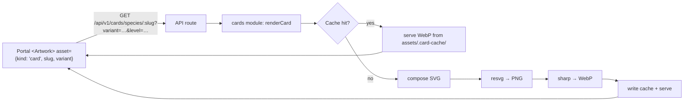

# Plan: WaifuMon SVG Card Rendering System

## TL;DR
Add a **server-side, data-driven card renderer** that composes the existing SVG kit + character artwork into a WebP, exposed through the Platform API as a new `AssetId` kind (`kind: 'card'`). Rendering lives in a new `src/modules/cards/` service, uses `@resvg/resvg-js` + `sharp`, writes to a content-addressed disk cache under `assets/.card-cache/`, and is invalidated automatically by cache key. The Portal consumes it via a new `card` provider in the existing image resolver chain — its `<Artwork>` component doesn't change. The `archetype` field on `species` maps 1:1 to the race icon set (no new field needed). The species Zod schema gains a small `card` block for the presentation-only fields the SVG kit expects (subtitle, artist, ability, flavor text, card number), all optional with defaults so existing content keeps working.

## Recommendation on Browser vs Server Rendering
**Server-side (Option A)**, with strong reasons rooted in this repo:

- `portal/src/__tests__/architecture.test.ts` enforces that the API never leaks image paths. The Portal already resolves art through `AssetId` + a provider chain. A new `kind: 'card'` fits that contract exactly; a browser SVG composer would require introducing raw artwork paths, string-substitution, and font/loader complexity into the SPA.
- The Portal is pure Tailwind + `` today — no SVG imports, no `dangerouslySetInnerHTML`. Introducing an SVG composer breaks a clean model.
- The bot doesn't render images yet, but "Discord-renderable card images" is a listed future requirement. A server renderer serves both without duplicating logic.
- Rasterization is deterministic and produces one artifact per (character × variant × template version) that can be cached, CDN-shipped, and downloaded at full resolution.
- Portal keeps instant, cheap thumbnails via the existing `/dev-assets/t/<width>/` path (rendered card is just another asset in that pipeline).

Option C (hybrid) was considered but rejected: adding two render paths doubles the "what does a card actually look like?" surface area and diverges over time. Server rendering can still be swapped for Satori/browser rendering later behind the same `kind: 'card'` contract without a data model change.

---

## Current State (verified findings)

Where each concern already lives:

- **Species / card metadata** — DB: [src/db/schema.ts](../src/db/schema.ts) (`species` table); Zod: [src/modules/content/schemas.ts](../src/modules/content/schemas.ts) (`SpeciesContentSchema`); JSON: [content/species/starter.json](../content/species/starter.json), [content/species/placeholders.json](../content/species/placeholders.json). Existing fields: `slug, name, rarity, archetype, baseCaptureRate, description, tags, contentRating, affinity, imagePath, enabled, eventKey, perSpeciesWeight`.
- **Rarity** — `RARITIES = ['N','R','SR','SSR','UR','LR','EX']` in [src/db/schema.ts](../src/db/schema.ts). Codes match the SVG kit (kit lacks `EX` — needs handling).
- **Affinity** — `AFFINITIES = ['dominant','submissive','caregiver','primal','switch']` in [src/db/schema.ts](../src/db/schema.ts). Matches SVG kit exactly.
- **Race** — Does **not** exist as a dedicated field. `archetype` is free-form but the corpus already uses exactly the 7 values `angel, demon, demi-human, human, spirit, valkyrie, android` (verified across every content JSON entry). This maps 1:1 to `assets/cardart/icons/races/`.
- **Level / progression** — `player_waifus.level` + `player_waifus.variant` (appearance id). Multiple variants per species; unlocks derived by [src/modules/appearance/appearanceRules.ts](../src/modules/appearance/appearanceRules.ts).
- **Artwork paths** — internal `species.imagePath` (never leaked) and appearance PNGs at `assets/waifumon/<slug>/<appearance-id>.png`. Sync via [src/tools/appearanceSync.ts](../src/tools/appearanceSync.ts).
- **Existing portal card UI** — pure Tailwind `` components: [portal/src/components/waifumon/WaifumonCard.tsx](../portal/src/components/waifumon/WaifumonCard.tsx), [portal/src/features/encyclopedia/SpeciesCard.tsx](../portal/src/features/encyclopedia/SpeciesCard.tsx), [portal/src/features/collection/WaifumonDetail.tsx](../portal/src/features/collection/WaifumonDetail.tsx). Asset resolution: [portal/src/images/](../portal/src/images/) provider chain via `AssetId`.
- **Static asset serving** — no `@fastify/static` on the API. Portal Vite dev server proxies `/dev-assets/*` → `../assets/` (see [portal/vite.config.ts](../portal/vite.config.ts)). Production has no CDN yet.
- **Image dependencies** — root: none. Portal (dev-only): `sharp@^0.35.3`. No `resvg`, `satori`, `puppeteer`, `canvas`.
- **Discord bot** — no image attachment or rendering code today ([src/discord/](../src/discord/) is text-embed only).
- **Testing** — Vitest with per-DB testcontainers; no snapshot files; portal tests use MSW.
- **SVG kit** — 1000×1400 viewBox, `character-art` uses `href="character-art.png"` (relative — renderer must rewrite), each rarity SVG **bakes its own `rarity-badge`** with the letter code embedded (renderer does not render rarity text separately, but must handle `EX` which is not in the kit).

### Missing species fields (needed by SVG kit)
Not present in `SpeciesContentSchema`, will need to be added as **optional** in Phase 2: `subtitle`, `artist`, `ability.name`, `ability.text`, `flavorQuote`, `cardNumber`. All default to sensible values so unmodified content keeps rendering.

---

## Proposed Architecture

### Data flow



The renderer is called only by the API route. Nothing else imports it directly, so it can be swapped (Satori, headless browser) without touching content, portal, or bot.

### Module boundary
- `src/modules/cards/` — renderer service (pure, no Fastify types)
- `src/modules/cards/assets/` — SVG loader with in-process memoization and version hash
- `src/modules/cards/composer/` — SVG DOM assembly (structural, not string replacement)
- `src/modules/cards/rasterizer/` — resvg + sharp pipeline
- `src/modules/cards/cache/` — content-addressed disk cache
- `src/api/routes/v1/cards.ts` — thin Fastify layer that resolves species/waifu, calls the module, streams the response
- `portal/src/images/providers/cardApi.ts` — new provider that answers `kind: 'card'`

---

## Data Model Changes

### Species schema (additive, all optional)
Extend `SpeciesContentSchema` in [src/modules/content/schemas.ts](../src/modules/content/schemas.ts) with a nested `card` block:

- `subtitle?: string` — 0–48 chars
- `artist?: string` — 0–48 chars
- `ability?: { name: string (≤32); text: string (≤160) }` — either both or neither
- `flavorQuote?: string` — 0–120 chars
- `cardNumber?: string` — e.g. `"012/100"` (free-form for future set numbering)
- `race?: RaceCode` — override the archetype-derived race icon (rarely needed; escape hatch)

No DB migration needed if we keep these in JSON content only (they're presentation data, not queried). If we later want DB-backed edits via the admin panel we add a single `card_meta jsonb` column — deferred to Phase 4.

### Race derivation (no new field)
Add `src/modules/cards/race.ts` exporting:

- `RACE_CODES = ['angel','demon','demi-human','human','spirit','valkyrie','android'] as const`
- `archetypeToRace(archetype: string): RaceCode` — normalizes (lowercase, hyphenate, alias table for future values). Unknown → `'human'` (safe fallback with a warning log; audit test enforces coverage across all content).

The Zod `race?` override in the species card block only applies when the archetype cannot be sensibly mapped (e.g. narrative species like "eldritch").

### `EX` rarity
Kit only ships `N/R/SR/SSR/UR/LR`. Renderer maps `EX → ur.svg` as a defensive default and logs a diagnostic. Phase 5 note: add `ex.svg` when placeholder art is replaced.

---

## Asset Structure

Keep the kit at its current location and grow it:

```
assets/cardart/
  templates/card-base.svg
  rarities/{normal,rare,sr,ssr,ur,lr}.svg
  icons/races/{angel,demon,demi-human,human,spirit,valkyrie,android}.svg
  icons/affinities/{dominant,submissive,switch,caregiver,primal}.svg
  fonts/           # NEW — embedded fonts for deterministic rendering
    Inter-Regular.ttf
    Inter-Bold.ttf
    NotoSerif-Italic.ttf
  VERSION          # NEW — bumped whenever any asset changes; part of cache key
```

`assets/.card-cache/` — gitignored, generated. Path shape:

```
assets/.card-cache/<slug>/<hash>.webp
assets/.card-cache/<slug>/<hash>.png   # optional full-fidelity mirror
```

Naming rules: lowercase, hyphenated for race and affinity, snake_case for slugs (already the convention).

---

## Renderer API

```ts
// src/modules/cards/types.ts
export interface CardRenderInput {
  species: {
    slug: string;
    name: string;
    rarity: Rarity;           // 'N' | 'R' | 'SR' | 'SSR' | 'UR' | 'LR' | 'EX'
    archetype: string;        // free-form; normalized internally to RaceCode
    affinity: Affinity;
    card?: SpeciesCardMeta;   // subtitle, artist, ability, flavor, cardNumber
  };
  variant: {
    appearanceId: string;         // e.g. 'standard', 'level_20'
    artworkAbsolutePath: string;  // resolved by caller; renderer never touches DB
  };
  progress?: {
    level: number;                // shown on the card
    ownedCopyId?: number;         // for owner-specific cards later; unused for now
  };
  output?: {
    format?: 'webp' | 'png';      // default 'webp'
    width?: number;               // CSS-px width; default 1000 (source)
    quality?: number;             // webp quality; default 88
  };
  overrides?: Partial<SpeciesCardMeta>;  // per-render overrides (rare)
}

export interface CardRenderResult {
  bytes: Buffer;
  contentType: 'image/webp' | 'image/png';
  cacheKey: string;               // hex hash; also the filename stem
  fromCache: boolean;
  width: number;
  height: number;
  etag: string;                   // strong ETag = cacheKey
}

export function renderCard(input: CardRenderInput): Promise<CardRenderResult>;
export function computeCardCacheKey(input: CardRenderInput): string;
export function warmCardCache(species: SpeciesContent, options?: WarmOptions): Promise<void>;
```

Design choices:

- Pure input → output. No Fastify request, no DB handle. Callers (API, batch warmer, bot) marshal their own inputs.
- `artworkAbsolutePath` is resolved by the caller — the renderer just reads bytes. This keeps the module ignorant of filesystem conventions and testable with fixtures.
- `warmCardCache` iterates variants and pre-renders in the background (used by `content:prepare` and future admin "Save + Reload").

---

## SVG Composition Strategy

**Do not use string replacement on text nodes.** Parse SVGs with a small XML parser (`fast-xml-parser`, already tiny + zero-dep-friendly), operate on the tree, then serialize. Rationale: rarity SVGs include gradients with IDs like `rarityStroke` and `glow` — naive concatenation collides. Structural manipulation is safer and lets us:

1. **Namespace overlay IDs.** When merging rarity overlay into base, prefix all `id`/`url(#…)` references with `rarity-` so we can safely composite any rarity file. Same for race/affinity icons.
2. **Substitute text by `id`.** Base template has `character-name`, `character-subtitle`, `level`, `race-label`, `affinity-label`, `affinity-description`, `affinity-description-2`, `ability-name`, `ability-text`, `ability-text-2`, `flavor-quote`, `artist-credit`, `card-number`. Locate each element by id and replace its text content with XML-escaped user data.
3. **Inject race and affinity icons** into the placeholder groups `<g id="race-icon">` and `<g id="affinity-icon">` by parsing the icon SVG's children and appending them inside the group. Icons use `currentColor` — we set `color` on the group.
4. **Wire artwork.** The base has `<image id="character-art" href="character-art.png" …>`. Replace `href` with a `file://` absolute path OR provide a resvg `imageLoader` callback. Prefer the callback: resvg-js supports it and avoids leaking absolute paths into the composed SVG. For the raster stage, artwork can also be pre-composited via sharp underneath the rasterized frame to squeeze more control over cropping (`preserveAspectRatio="xMidYMid slice"` is already correct in the SVG — start with the SVG path and only fall back to sharp compositing if resvg image handling has issues on Windows/Docker).
5. **Composite order** (bottom → top): artwork → base template chrome → rarity overlay → race icon in its slot → affinity icon in its slot → dynamic text. This matches the pipeline diagram in the brief.

---

## Text Handling

Every user-supplied string is:

1. **XML-escaped** (`&`, `<`, `>`, `"`, `'`). Central helper; no ad-hoc string concat.
2. **Length-truncated** at hard caps enforced in Zod (see schema section) with a suffix `…`. Truncation happens in the composer, not the Zod layer, so authored strings pass validation up to their cap and the composer never has to worry about pathological input.
3. **Auto-sized** for `character-name` only: fit widths at 54/44/36 px (three tiers) by measuring approximate glyph width from a small metric table (or opentype.js if we accept the dep — probably not needed at this scale). Everything else uses fixed size; overflow truncates.
4. **Wrapped** for `ability-text` and `affinity-description`, which already have `-2` sibling elements in the template. Splitter: greedy word-wrap into 2 lines with per-line char budget (measured against font size). If content exceeds 2 lines → truncate the second line with `…`.
5. **Fonts embedded** via resvg's `font.fontFiles` option, pointing at `assets/cardart/fonts/`. Fallback family in the SVG stays `Arial, Helvetica, sans-serif` for browser preview but rendering is deterministic on server thanks to embedded fonts. Explicitly configure `defaultFontFamily: 'Inter'` on resvg; no system font resolution.

Edge cases handled in unit tests: empty strings (element removed rather than left with placeholder), CJK characters, emoji (fall back to Noto or strip in v1 — decision below), RTL scripts (not a v1 concern; log warning).

---

## Rendering & Caching

### Libraries
Add to root `package.json`:
- `@resvg/resvg-js@^2.6` — SVG → PNG (Rust, prebuilt binaries, works in Alpine Docker)
- `sharp@^0.33` — PNG → WebP + optional resize/composite (already trusted by the portal build)
- `fast-xml-parser@^4` — structural SVG mutation
- `@types/…` where relevant

### Output dimensions
Source SVG is 1000×1400. Render at that size for the master; sharp emits additional buckets `{512×716, 256×358}` on demand mirroring the existing `IMAGE_SIZE_BUCKETS`. Store master + buckets under the same cache key.

### Cache key
`sha256(json.stringify({...})).slice(0,16)` over a canonicalized object of everything that affects pixels:

- `species.slug`, `rarity`, `raceCode` (post-normalization), `affinity`
- `card` block (name, subtitle, artist, ability, flavor, cardNumber, level)
- `variant.appearanceId`
- `artworkFingerprint` = mtime-ns + size of the artwork file (fast) OR sha256 of the first 64 KB (deterministic across rebuilds) — start with mtime+size, switch to hash if determinism proves flaky
- `kitVersion` = contents of `assets/cardart/VERSION`
- `rendererVersion` = constant string bumped on renderer code changes

Filename: `<slug>/<key>.webp`. Serving code checks disk; on miss it renders and writes atomically (`.tmp` + rename).

### Invalidation
- **Automatic**: any change to art, template, kit VERSION, renderer, or card metadata changes the key. Old files become orphans.
- **GC**: `npm run cards:gc` iterates the cache and deletes files whose key doesn't match any current species×variant. Optional; disk is cheap.
- **Kit change workflow**: bump `assets/cardart/VERSION`, restart. No manual purge.

### HTTP semantics
- Response: `ETag: "<cacheKey>"`, `Cache-Control: public, max-age=300, must-revalidate` (mirrors existing `/dev-assets`), `Content-Type: image/webp`.
- `304 Not Modified` on matching `If-None-Match`.
- Immutable option: if a client requests `?v=<cacheKey>`, respond `max-age=31536000, immutable`. Portal's `useImage` can append this once the API tells it the key.

---

## Playtest Integration

Minimal, non-invasive:

1. **New Platform API routes** in [src/api/routes/v1/cards.ts](../src/api/routes/v1/cards.ts) (new file):
   - `GET /api/v1/cards/species/:slug` — query `?variant=&level=&format=&width=`
   - `GET /api/v1/players/:playerId/collection/owned/:waifuId/card` — resolves the owned copy's species, variant, level and delegates to the module. Auth via the existing token guard.
   Both return the raster directly with the cache headers above.

2. **`AssetId` gains `'card'` kind** in [portal/src/images/types.ts](../portal/src/images/types.ts) (extend `AssetKind`). The architecture test that forbids image paths continues to pass because `AssetId` is still purely `{kind, slug, variant}`.

3. **New provider** `portal/src/images/providers/cardApi.ts` that maps `{kind:'card', slug, variant}` → `/api/v1/cards/species/<slug>?variant=<variant>` (respecting the `bucket` param via `&width=`). Registered after `apiSuppliedUrl` and before `localDevAssets` in the provider chain.

4. **`speciesCardAsset(species, waifu?): AssetId`** helper in [portal/src/images/assets.ts](../portal/src/images/assets.ts) — sibling to `speciesAsset()`. Returns `kind:'card'` for a rendered full card, keeps `speciesAsset()` (kind: waifumon) for the raw artwork tile.

5. **Component adoption** — deliberately narrow first:
   - [WaifumonDetailPage](../portal/src/features/collection/WaifumonDetailPage.tsx) hero: add a "View Card" toggle that swaps `<Artwork asset={speciesAsset(…)}>` for `<Artwork asset={speciesCardAsset(…)} displayWidth={512}>`. Existing artwork view stays as default.
   - Full-resolution "Export card" button downloads the full 1000×1400 WebP.
   - Encyclopedia grid tile and Collection grid tile keep using raw artwork tiles (fast + cheap). Do not switch the whole grid to rendered cards.

6. **Backwards compat** — species lacking `card` metadata still render (subtitle blank, ability hidden, artist "Unknown"). Level defaults to 1 if not supplied. Nothing in existing flows breaks.

7. **Bot integration** is explicitly **out of scope** for v1 but the module boundary already supports it. A follow-up ticket wires an `AttachmentBuilder` around `renderCard()` for `/wm show` or capture toasts.

---

## Migration / Backward Compatibility

- No DB migration.
- No content migration required to *ship* the feature; content authors add `card` blocks incrementally.
- Portal continues to render raw artwork; the card view is an opt-in toggle. If the render endpoint is disabled the toggle is hidden.
- Feature flag: `CARD_RENDERER_ENABLED` (env var; defaults on in dev, off in prod until asset kit is polished). API route registration guarded by the flag.

---

## Testing

### Unit (`tests/unit/cards/`)
- `archetypeToRace.test.ts` — every archetype in current content resolves to a valid `RaceCode`
- `cacheKey.test.ts` — key is stable for identical input, changes on each dimension (rarity, race, affinity, artwork mtime, level, kit VERSION, renderer version)
- `text.test.ts` — XML escape, truncation, 2-line wrap, empty input drops the element
- `svgComposer.test.ts` — id namespacing avoids `url(#…)` collisions between base and rarity overlays; ability/flavor absence removes elements cleanly
- `race.test.ts` / `affinity.test.ts` — icon SVG loaded into placeholder group; `currentColor` respected

### Integration (`tests/integration/cards/`)
- `render.matrix.test.ts` — parameterized across `RARITIES × 7 races × 5 affinities` = 245 combos rendered against a single fixture species. Assert non-empty WebP, correct dimensions, deterministic bytes across two renders (no random state). Runs once; ~10s budget.
- `render.missingFields.test.ts` — species with no `card` block, missing artwork file, unknown rarity `EX`, unknown archetype fallback
- `cache.test.ts` — cache miss writes exactly one file, second call hits cache, cache-key change on artwork mtime bump renders a new file, atomic write (no partial `.webp` on failure)
- `api/cards.test.ts` — end-to-end Fastify route with real DB (testcontainers pattern in [tests/integration/api/](../tests/integration/api/)): 200 with correct headers, 304 on matching ETag, feature flag off returns 404, owner scoping on the player route

### Portal (`portal/src/images/__tests__/`)
- `cardApiProvider.test.ts` — MSW returns a stub image; provider builds correct URLs including `bucket` → `width`
- `WaifumonDetailPage.test.tsx` — "View Card" toggle switches asset kind; export button downloads

### Golden-image / visual snapshots
Recommended but **narrow**: keep a fixed fixture species with each rarity + one representative race + one affinity (6 files). Store expected WebPs under `tests/fixtures/cards/golden/`. Compare byte-equal on Linux CI to catch accidental font/composition regressions. Skip on Windows dev runs (font rasterization can differ subtly). Regenerate with `npm run cards:golden`.

Do **not** golden-test all 245 combos; the matrix test above already guards their existence and shape.

---

## Implementation Phases

### Phase 1 — Renderer foundation (isolated module, no wiring)
- Add deps: `@resvg/resvg-js`, `sharp`, `fast-xml-parser`
- New: `src/modules/cards/{types,race,text,composer,rasterizer,cache,index}.ts`
- New: `assets/cardart/fonts/` (Inter + Noto Serif Italic); `assets/cardart/VERSION`
- New: `tests/unit/cards/*`, `tests/integration/cards/render.matrix.test.ts`
- No API surface, no portal changes yet
- **Files touched**: none outside the new module
- **Acceptance**: `renderCard(fixture)` returns a valid WebP for all 245 combinations; matrix test passes; unit coverage ≥ 90% of the module

### Phase 2 — Species metadata + race normalization
- Extend `SpeciesContentSchema` with the optional `card` block; regenerate types
- Add `archetypeToRace()` unit-verified against every entry in `content/species/*.json`
- Update [docs/content-authoring.md](../docs/content-authoring.md) with a "Card metadata" section
- Optional: seed 2–3 species with real `card` blocks (subtitle, ability, artist) as living examples
- **Files touched**: [src/modules/content/schemas.ts](../src/modules/content/schemas.ts), [docs/content-authoring.md](../docs/content-authoring.md), 2–3 files under `content/species/`
- **Acceptance**: `npm run typecheck` clean; content validation passes on cold start; existing playtest unchanged; card rendering picks up new metadata when present

### Phase 3 — API surface + cache + feature flag
- New: [src/api/routes/v1/cards.ts](../src/api/routes/v1/cards.ts) with two routes
- New: [tests/integration/api/cards.test.ts](../tests/integration/api/cards.test.ts)
- Add `CARD_RENDERER_ENABLED` (defaults true in dev, false in prod)
- Add `.gitignore` entry for `assets/.card-cache/`
- Add `npm run cards:warm` and `npm run cards:gc` scripts
- **Files touched**: [src/api/server.ts](../src/api/server.ts) route registration, [src/config/](../src/config/) env schema
- **Acceptance**: `curl /api/v1/cards/species/alley_catgirl?variant=standard&level=12` returns a WebP; hitting again logs a cache hit; ETag round-trip returns 304

### Phase 4 — Portal integration (opt-in)
- Extend `AssetKind` with `'card'`; add `speciesCardAsset()` helper
- New: `portal/src/images/providers/cardApi.ts`; register in provider chain
- Update [WaifumonDetailPage](../portal/src/features/collection/WaifumonDetailPage.tsx): add "View Card" toggle + "Export card" download; keep default = artwork
- Extend MSW: mock the new endpoints with a small fixture image
- Portal tests: provider unit test + detail-page toggle test
- **Files touched**: [portal/src/images/types.ts](../portal/src/images/types.ts), [portal/src/images/assets.ts](../portal/src/images/assets.ts), [portal/src/images/provider.ts](../portal/src/images/provider.ts), [portal/src/features/collection/WaifumonDetailPage.tsx](../portal/src/features/collection/WaifumonDetailPage.tsx), [portal/src/__tests__/architecture.test.ts](../portal/src/__tests__/architecture.test.ts) (verify still green), [portal/msw/handlers.ts](../portal/msw/handlers.ts)
- **Acceptance**: card view visible on detail page; grid pages unchanged; architecture test still passes; export button downloads a 1000×1400 WebP

### Phase 5 — Visual asset replacement + polish
- Replace placeholder rarity/race/affinity SVGs with polished versions (no code change; bump `assets/cardart/VERSION`)
- Add `ex.svg` for `EX` rarity
- Optional: add golden-image tests locked to Linux CI
- Announce card renderer in changelog
- **Files touched**: `assets/cardart/**` only
- **Acceptance**: cache invalidates on VERSION bump; visual smoke pass by hand on 3 rarities

---

## Risks & Unresolved Decisions

1. **Emoji / non-Latin glyphs in `character-name`.** Some future waifumon may have names with non-Latin glyphs. Recommend embedding Noto Sans CJK subset in `assets/cardart/fonts/` from the start, or restricting names to Latin-1 for v1. **Recommendation: Latin-1 only for v1; add Noto CJK in Phase 5 if the need appears.**
2. **`sharp` in the API service.** Adds a native dep with Windows/Docker footprint. Verified in portal already; low risk. Dockerfile may need `--platform=linux/amd64` care.
3. **Font licensing.** Inter is OFL; NotoSerif is OFL. Both safe to embed and ship.
4. **`EX` rarity.** No overlay exists. **Recommendation: map to `ur.svg` with a warning until a dedicated `ex.svg` ships.**
5. **Cache disk growth.** Content-addressed but never TTL-expired. **Recommendation: ship `cards:gc` from Phase 3; document in ops notes.**
6. **Determinism across OSes.** resvg + embedded fonts are usually deterministic, but sub-pixel differences between Linux and Windows are common. **Recommendation: gate golden-image tests on `process.env.CI` + `os.platform() === 'linux'`.**
7. **Owned-copy owner-personalization.** Should the player's Discord tag or copy number appear on the card? Left out of v1 to keep cards cacheable per species+variant+level. Adding it later is a matter of extending the cache key.
8. **Should rendered cards be an `AssetId` (`kind:'card'`) or an escape-hatched URL like `player.identity.avatarUrl`?** Recommend `AssetId`. The URL escape hatch is documented for cases where the *API cannot derive the URL* (Discord CDN). Here the API can. Keeping the abstraction intact preserves the architecture invariant.
9. **Renderer in the same process as the game bot?** Yes — rendering is on-demand and cheap once cached; separating it into a worker is premature. Revisit if warming becomes a bottleneck.
10. **Do we want per-owned-copy XP/affection on the card?** Out of scope for v1; keeps caching simple.

---

## Handoff Checklist (for the coding agent)

- [ ] Add deps: `@resvg/resvg-js`, `sharp`, `fast-xml-parser` in root `package.json`
- [ ] Create `src/modules/cards/` with `types.ts`, `race.ts`, `text.ts`, `composer.ts`, `rasterizer.ts`, `cache.ts`, `index.ts` exposing `renderCard`, `computeCardCacheKey`, `warmCardCache`
- [ ] Add `assets/cardart/VERSION` (start at `1`)
- [ ] Add `assets/cardart/fonts/` with Inter Regular/Bold + Noto Serif Italic
- [ ] Gitignore `assets/.card-cache/`
- [ ] Extend `SpeciesContentSchema` in [src/modules/content/schemas.ts](../src/modules/content/schemas.ts) with optional `card` block (subtitle, artist, ability{name,text}, flavorQuote, cardNumber, race)
- [ ] Verify `archetypeToRace()` covers every archetype in `content/species/*.json` via a unit test
- [ ] Add `CARD_RENDERER_ENABLED` env flag; register [src/api/routes/v1/cards.ts](../src/api/routes/v1/cards.ts) conditionally in [src/api/server.ts](../src/api/server.ts)
- [ ] Implement two routes: `GET /api/v1/cards/species/:slug`, `GET /api/v1/players/:playerId/collection/owned/:waifuId/card`
- [ ] Add ETag + Cache-Control + 304 handling; canonical query params (`variant`, `level`, `format`, `width`)
- [ ] Add `npm run cards:warm` and `npm run cards:gc` scripts
- [ ] Add unit tests in `tests/unit/cards/`; matrix + missing-fields + cache tests in `tests/integration/cards/`; API test in `tests/integration/api/cards.test.ts`
- [ ] Extend `AssetKind` with `'card'` in [portal/src/images/types.ts](../portal/src/images/types.ts); confirm [portal/src/__tests__/architecture.test.ts](../portal/src/__tests__/architecture.test.ts) still passes
- [ ] Add `speciesCardAsset()` in [portal/src/images/assets.ts](../portal/src/images/assets.ts); new `cardApi` provider registered in [portal/src/images/provider.ts](../portal/src/images/provider.ts)
- [ ] Add "View Card" toggle + "Export card" button on [portal/src/features/collection/WaifumonDetailPage.tsx](../portal/src/features/collection/WaifumonDetailPage.tsx)
- [ ] Extend MSW handlers in [portal/msw/handlers.ts](../portal/msw/handlers.ts) with a stub image response
- [ ] Update [docs/content-authoring.md](../docs/content-authoring.md) with a "Card metadata" section and a note on `assets/cardart/VERSION`
- [ ] Seed 2–3 species with real `card` blocks as living examples
- [ ] Manual smoke: render every rarity for `alley_catgirl` end-to-end via the API; verify visuals
